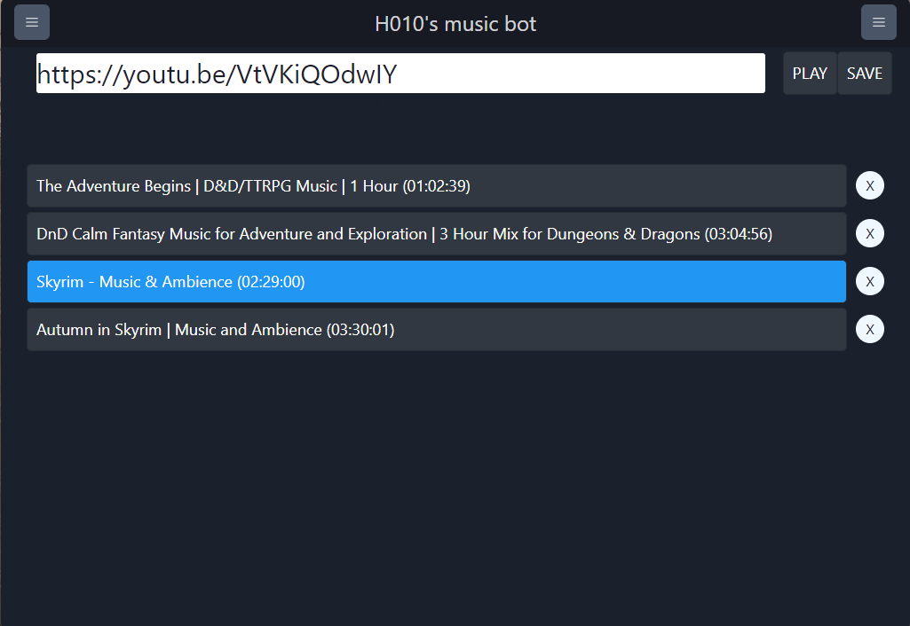

# H010's DnDMusicBot

This is an electron-react-boilerplate "fork" which i built this bot control program on.

It allows you to play .mp3 files from your computer on a discord server your bot is invited to.

It also allows you to play youtube audio, with limited support at the current moment.

## Preview

<p>Main screen</p>
    
<p>Side menus</p>
    
<p>Youtube player preview</p>
    

### How to use:

#### You will need:

1. This program installed
2. A server you want to play music on (and have the ability to invite bots to (or have someone who can))
3. Personal discord bot. (Instructions on how to create it are below)

#### Use it:

1. Once you have a bot created and his token saved. Open the program and in the starting screen paste in your bot token and press start. (You can toggle on "Save token" checkmark to start your bot with the saved token later).
2. Once the the program fully starts, you can press the "CHANGE FOLDER" button to open the directory of the music you want to play. You need .mp3 files in the directory to stream the audio. Once the folder has been selected, it will also scan folders 1 level below to search for your .mp3 files. This allows you to create "playlists", with each folder having the specific music for you to play.
3. Opening the right side menu allows you to connect your bot to voice channels. If you don't have a server and voice channels to select from, press the copy button of the your discord bot avatar to copy the invite link. Pasting it into the browser will allow you to invite the bot onto your server. After successfully inviting, press REFRESH.
4. Select a server and voice channel for bot to join.
5. Thats it! Press on a .mp3 to stream the audio. Use the slider on top to change current playtime, pause and etc.

### FAQ:

> Q: Why not soundpad?

> A: Soundpad is a good choice for most, but soundpad uses your own microphone to stream audio. That means you have to have your microphone enabled 100% of the time you want to stream audio in discord. Plus, noise suppression and auto mic activation hurt the player experience when it comes to music.

<br/>

> Q: Why even make it?

> A: Our DM - H010, gave me this idea of making a discord bot, that can play any selection of music you have on hand. Using a discord bot would allow any player to adjust volume of music as needed, for them personally. Using a public music bot has it's problems, but main one is reliability. In my experience public bots are clunky, don't always work and have problems with how you interact with them. Thus, the UI controlling program has been created.

# Set up your own bot!:

In order to use this program you need your own bot. For this you have to create your own application on the discord developer panel.

1. Head over to: https://discord.com/developers/applications

2. Press "New Application"

3. Give your application a name, accept ToS and press "Create"

4. Customize your bot on the "General Information" tab. Give him a name or maybe change his picture.

5. Head over to the "Bot" tab.

6. MAKE SURE you have message content intent enabled. (This is important)

<p align="center">
    
</p>

#### (You may skip step 7 and 8 if on version 0.3.1, as it include a copy invite URL button in the right side menu)

7. Now head over to "OAuth2" -> "URL Generator" tab. To generate an invitation link, to invite the bot to the server you want to play music on.

8. Set the scopes of your application to "bot" and his permissions to: "Connect", "Speak", "Send Messages", "Send Messages in Thread" just like in the image below and press "Copy". Use this link to invite the bot on the server.

####

<p align="center">
    
</p>

9. Now head over again to the "Bot" tab and press "Reset Token". (Warning: If you have active applications that use the same bot, their token will be destroyed).

10. Thats it! Now you can use the bot. Just open the app, insert your token and press start!

# How to build yourself!!

## You will probably need:

- Python installed on your PC
- windows-build-tools
- node v16

## Start it dev:

```bash
cd ./DNDMusicBot

npm i

npm start

# DEVELOP!
```

## Make it

```bash
cd ./DNDMusicBot

npm ci

npm run package
```

Then navigate to ./release/build/

You will packaged files there!

# Releases:

### I only started to document these on release 0.2.1.. So.. dont expect much..

### 0.3.2

- Fix discord.js crashing over the non existence of ffmpeg on system that do no have it installed.

### 0.3.1

- Migrated to Chakra UI
- Major UI redesign
- Added ability to play youtube links (preview).
- Starting with a saved token, without have a token saved now returns to main screen, instead of infinite loading.
- Fixed a memory leak when using electron state.
- Fixed a bot not disconnecting from voice channels when hopping from server to server.

### 0.2.3

- Major redesign (again lol)

### 0.2.2:

- Removed ffbrope. This should reduce bundle size and improve audio loading speeds.
- Added Russian and English locales.
- Added a way to use own token. Token is now saved at ~Documents/h010MusicBot/token.txt
- Now playback time shows proper time with hours included (previously was limited to minutes and seconds only.
- Fixed a memory leak involving event handlers not unsubscribing from events on state changes.

### 0.2.1:

- Lots of errors and memory leakage fixes.
- 1 level subfoler scan + mp3 files included in the subfolder for organization of playable files.
- ffmpeg/ffprobe are now bundled in the installation file
- Changed design a bit
- Autoplay and Repeat slider toggle. (Repeat will take priority)
