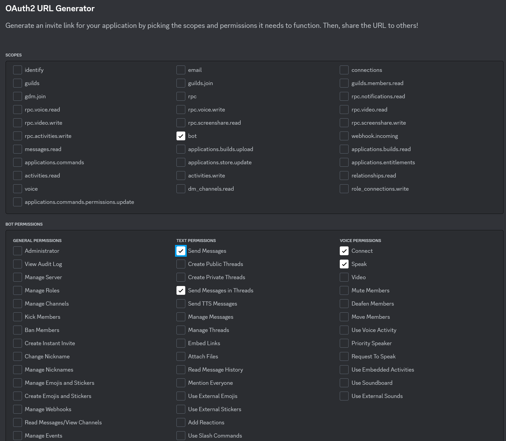

# H010's DnDMusicBot

This is an electron-react-boilerplate "fork" which i built this bot control program on.

This is a Discord bot control program which allows to play mp3 files saved locally on your drive. You can manually control what Server and Channel the bot is in and manually select mp3 files to play.

<p align="center">
    
</p>

H010 is our DM and he gave me this idea.. thus why it is called H010's DnDMusicBot

## Start it dev:

```bash
cd ./DNDMusicBot

npm ci

npm start

# DEVELOP!
```

## Make it

```bash
cd ./DNDMusicBot

npm ci

npm run package
```

Then navigate to ./release/build/

You will find all the files

# Set up your own bot!:

In order to use this program you need your own bot. For this you have to create your own application on the discord developer panel.

1. Head over to: https://discord.com/developers/applications

2. Press "New Application"

3. Give your application a name, accept ToS and press "Create"

4. Customize your bot on the "General Information" tab. Give him a name or maybe change his picture.

5. Head over to the "Bot" tab.

6. MAKE SURE you have message content intent enabled. (This is important)

<p align="center">
    
</p>

7. Now head over to "OAuth2" -> "URL Generator" tab.

8. Set the scopes of your application to "bot" and his permissions to: "Connect", "Speak", "Send Messages", "Send Messages in Thread" just like in the image below:

<p align="center">
    
</p>

9. Now head over again to the "Bot" tab and press "Reset Token". (Warning: If you have active applications that use the same bot, their token will be destroyed).

10. Thats it! Now you can use the bot. Just open the app, insert your token and press start!

# Releases:

### I only started to document these on release 0.2.1.. So.. dont expect much..

### 0.2.2:

- Removed ffbrope. This should reduce bundle size and improve audio loading speeds.
- Added Russian and English locales.
- Added a way to use own token. Token is now saved at ~Documents/h010MusicBot/token.txt
- Now playback time shows proper time with hours included (previously was limited to minutes and seconds only.
- Fixed a memory leak involving event handlers not unsubscribing from events on state changes.

### 0.2.1:

- Lots of errors and memory leakage fixes.
- 1 level subfoler scan + mp3 files included in the subfolder for organization of playable files.
- ffmpeg/ffprobe are now bundled in the installation file
- Changed design a bit
- Autoplay and Repeat slider toggle. (Repeat will take priority)
